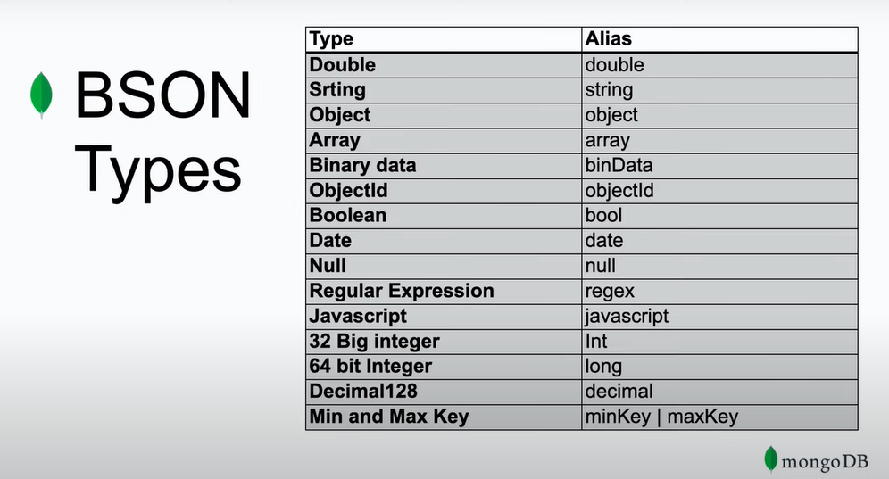

Mongo stores documents(rows) in collections(table)
Each json is document and collection is all of the documents(table as said)

MongoDb stores data records as BSON documents.
BSON is a binary representation of JSON documents.

Data types:

